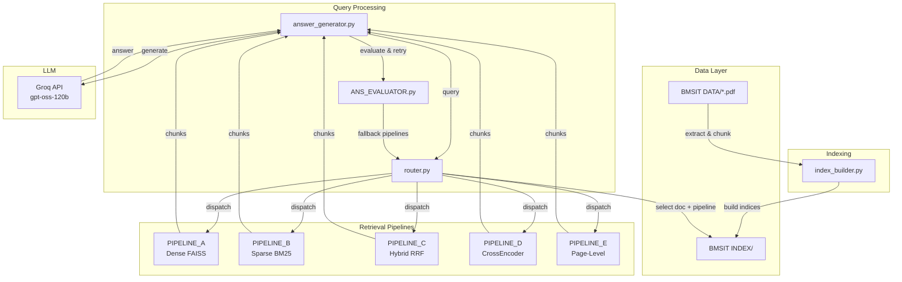
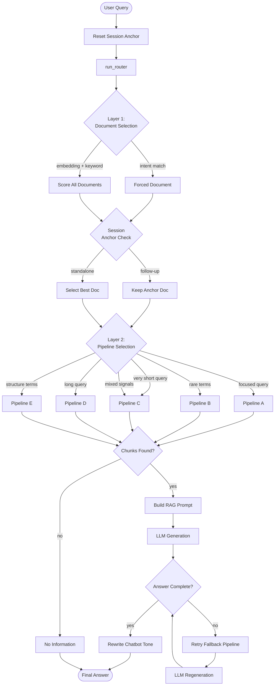
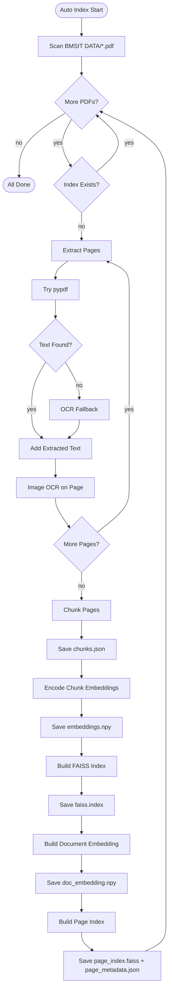
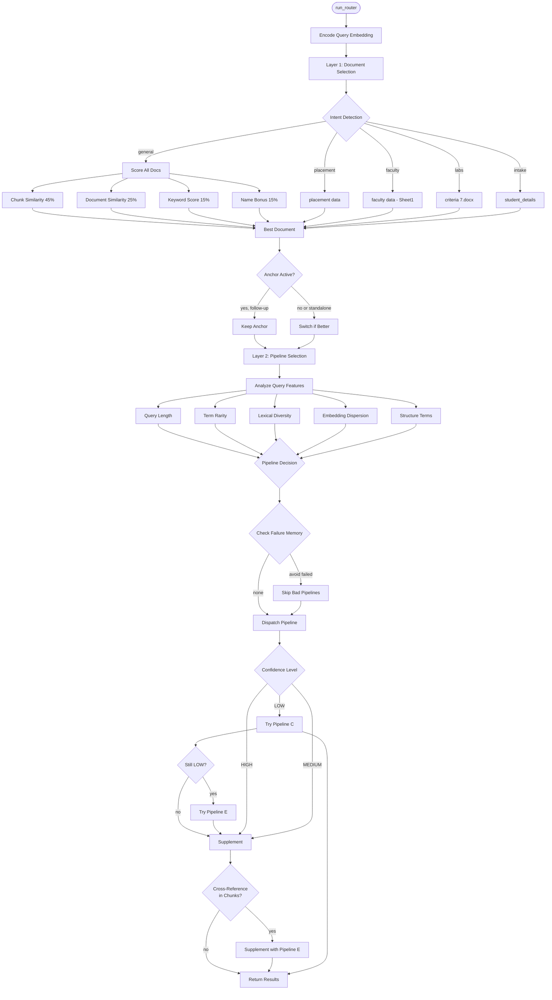
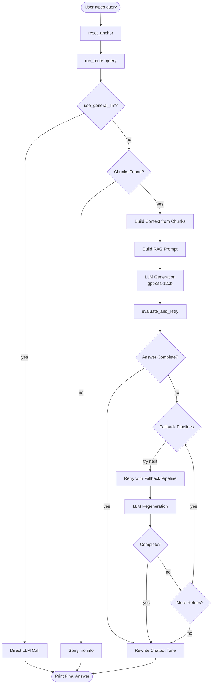

# BMSIT Admission Chatbot — RAG System (v1)

A Retrieval-Augmented Generation (RAG) based chatbot for **BMS Institute of Technology & Management** that answers admission-related queries using indexed PDF documents.

---

## Table of Contents

- [Architecture Overview](#architecture-overview)
- [System Flowchart](#system-flowchart)
- [Index Builder Flow](#index-builder-flow)
- [Router Flow](#router-flow)
- [Pipeline Flow](#pipeline-flow)
- [Answer Generation & Evaluation Flow](#answer-generation--evaluation-flow)
- [Project Structure](#project-structure)
- [Component Details](#component-details)
- [How to Run](#how-to-run)
- [Retrieval Test Questions](#retrieval-test-questions)
- [Notes](#notes)

---

## Architecture Overview



---

## System Flowchart



---

## Index Builder Flow



---

## Router Flow



---

## Pipeline Flow

```mermaid
flowchart TB
    subgraph "Pipeline A — Dense FAISS"
        A1[Query] --> A2[Encode with<br/>all-MiniLM-L6-v2]
        A2 --> A3[FAISS IndexFlatIP<br/>Search top-k]
        A3 --> A4[Return Chunks<br/>+ Confidence]
    end

    subgraph "Pipeline B — Sparse BM25"
        B1[Query] --> B2[Preprocess + Lemmatize]
        B2 --> B3[BM25Okapi Scoring]
        B3 --> B4[Rank & Filter top-k]
        B4 --> B5[Return Chunks<br/>+ Confidence]
    end

    subgraph "Pipeline C — Hybrid RRF"
        C1[Query] --> C2[Dense: FAISS Search]
        C1 --> C3[Sparse: BM25 Scoring]
        C2 --> C4[Reciprocal Rank Fusion]
        C3 --> C4
        C4 --> C5[Return Merged Chunks<br/>+ Confidence]
    end

    subgraph "Pipeline D — CrossEncoder Rerank"
        D1[Query] --> D2[FAISS Search top-30]
        D2 --> D3[CrossEncoder<br/>ms-marco-MiniLM]
        D3 --> D4[Sigmoid Normalize]
        D4 --> D5[Rank & Return top-k<br/>+ Confidence]
    end

    subgraph "Pipeline E — Page-Level"
        E1[Query] --> E2{FORCE_PAGE?}
        E2 -->|yes| E3[Return Exact Page]
        E2 -->|no| E4{LAST_RESORT?}
        E4 -->|yes| E5[Search top-3 Pages<br/>+ Cross-References]
        E4 -->|no| E6[Semantic Page Search<br/>top-k]
        E3 --> E7[Return Pages<br/>+ Confidence]
        E5 --> E7
        E6 --> E7
    end
```



---

## Answer Generation & Evaluation Flow



---

## Project Structure

```text
BMSIT_RAG -2/
|
|-- BMSIT DATA/                  # Source PDFs used for indexing
|
|-- BMSIT INDEX/                 # Auto-created per-document index folders
|   `-- <pdf_name>/
|       |-- chunks.json          # Text chunks with page metadata
|       |-- embeddings.npy       # Chunk-level embeddings
|       |-- doc_embedding.npy    # Full-document embedding
|       |-- faiss.index          # Dense chunk index
|       |-- page_index.faiss     # Page-level index
|       `-- page_metadata.json   # Full page text metadata
|
|-- INDEX_BUILDER/
|   `-- index_builder.py         # Builds all chunk/page indices from PDFs
|
|-- PIPELINES/
|   |-- PIPELINE_A.py            # Dense FAISS retrieval
|   |-- PIPELINE_B.py            # Sparse BM25 retrieval
|   |-- PIPELINE_C.py            # Hybrid FAISS + BM25 via RRF
|   |-- PIPELINE_D.py            # Dense retrieval + CrossEncoder reranking
|   |-- PIPELINE_E.py            # Page-level retrieval and cross-reference support
|   `-- pipeline_utils.py        # Shared dynamic top-k logic
|
|-- ROUTER/
|   `-- router.py                # Document routing + pipeline routing
|
|-- LLMs/
|   |-- answer_generator.py      # Main chatbot entry point
|   `-- ANS_EVALUATOR.py         # Answer completeness retry + tone rewrite
|
|-- requirements.txt
|-- README.md
`-- router_failure_log.json      # Auto-generated router failure memory
```

---

## Component Details

### Index Builder (`INDEX_BUILDER/index_builder.py`)

Scans all PDFs inside `BMSIT DATA/` and builds document-level and page-level indexes inside `BMSIT INDEX/`.

- Prefers `pypdf` text extraction (preserves table ordering)
- Falls back to `pdfplumber` if needed
- OCR fallback for scanned pages
- Image OCR on embedded page images
- Creates chunk embeddings, document embeddings, FAISS chunk indexes, and page-level indexes

### Router (`ROUTER/router.py`)

Two-layer retrieval router:

**Layer 1 — Document Selection:**
- Chunk similarity (45%)
- Document-level similarity (25%)
- Keyword overlap (15%)
- Document-name bonus for intent-aligned PDFs (15%)
- Session anchor for follow-up queries (TTL: 8 queries)

**Layer 2 — Pipeline Selection:**
- Analyzes query length, term rarity, lexical diversity, embedding dispersion
- Detects structure terms and table/image references
- Router memory avoids pipelines that failed on similar past queries
- Low-confidence fallback: Pipeline C → Pipeline E

### Pipelines

| Pipeline | Method | Best For |
|----------|--------|----------|
| **A** | Dense FAISS (cosine similarity) | Focused, single-concept queries |
| **B** | Sparse BM25 with lemmatization | Exact terms, acronyms, structured wording |
| **C** | Hybrid FAISS + BM25 via RRF | Mixed semantic + keyword queries |
| **D** | Dense FAISS + CrossEncoder rerank | Long, complex, multi-aspect questions |
| **E** | Page-level retrieval | "See page N" queries, cross-references, last resort |

### Answer Generator (`LLMs/answer_generator.py`)

Main terminal chatbot loop:
- Resets anchor for each new standalone query
- Routes query through the router
- Builds strict context-only RAG prompt
- Tells model to read tables carefully
- Prefers `CAY` / `2025-26` values for current-year questions
- Explicitly lists companies, faculty, labs when present
- Evaluates and retries if answer appears incomplete

### Answer Evaluator (`LLMs/ANS_EVALUATOR.py`)

- Checks if answer is complete (detects "not available", "I don't know" patterns)
- Retries with fallback pipelines (up to 3 retries)
- Rewrites final answer into warm admissions-chatbot tone

---

## How to Run

### Step 1: Activate the environment

```powershell
Set-ExecutionPolicy -Scope Process -ExecutionPolicy RemoteSigned
& ".\rag_env\Scripts\Activate.ps1"
```

### Step 2: Install dependencies

```powershell
pip install -r requirements.txt
```

### Step 3: Configure API key

Copy the `.env` file and add your Groq API key:

```text
GROQ_API_KEY=your_groq_api_key_here
```

> **Important:** The `.env` file is listed in `.gitignore` and will never be committed to GitHub. Never share or commit your API key.

### Step 4: Add or update PDFs

Place all source PDFs inside:

```text
BMSIT DATA/
```

### Step 5: Build or rebuild the index

```powershell
& ".\rag_env\Scripts\python.exe" ".\INDEX_BUILDER\index_builder.py"
```

Run this whenever:
- New PDFs are added
- Existing PDFs are replaced
- Extraction or indexing logic changes

### Step 6: Start the chatbot

```powershell
& ".\rag_env\Scripts\python.exe" ".\LLMs\answer_generator.py"
```

Type `exit` to quit.

---

## Retrieval Test Questions

Use these to quickly verify retrieval:

1. What is the sanctioned intake for the program in `CAY 2025-26`?
2. Which companies have recently recruited students from this department?
3. What placement records are available for the `2025 batch`?
4. Who are the faculty members in the AI&ML department, and what are their specializations?
5. What laboratories and practical facilities are available for students in this department?

---

## Notes

- Tesseract OCR must be installed for scanned PDF support. Update the path in `INDEX_BUILDER/index_builder.py` if needed.
- The index builder supports both `BMSIT DATA` / `BMSIT_DATA` and `BMSIT INDEX` / `BMSIT_INDEX`.
- `router_failure_log.json` is auto-generated and stores failed pipeline memory for similar queries.
- If retrieval behavior changes after editing PDFs or routing logic, rebuild the indexes before testing again.

---

## Roadmap

### v1 (Current) — Core RAG Architecture
- [x] PDF extraction with OCR fallback
- [x] FAISS dense + BM25 sparse indexing
- [x] Two-layer router (document + pipeline selection)
- [x] 5 retrieval pipelines (A–E)
- [x] Answer evaluation + retry with fallback pipelines
- [x] Chatbot tone rewriting
- [x] CLI interface

### v2 (Planned) — FastAPI Backend + Web Frontend
- [ ] FastAPI REST API endpoints for chat
- [ ] Session management and conversation history
- [ ] Web-based chat UI (React/Streamlit)
- [ ] Admin dashboard for document management
- [ ] Async pipeline execution
- [ ] Rate limiting and authentication
- [ ] Docker deployment support

